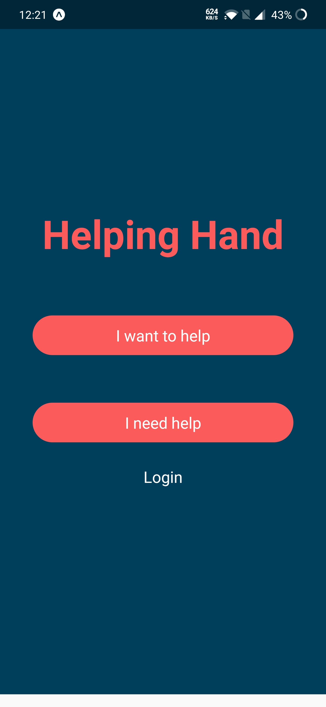

# Helping Hand
This repo is for a mobile application developed with React Native. 

The idea is simple - a place where if you're in need of help you can ask for it. And if you're looking to help you can find those in need.

## Where to start

## I'm in need of help
People looking for help can sign up and add content to their profile seen but helpers. They can add tags for better understanding, and a bio to describe their scenario.

## I'm looking to help
Helpers can sign up and see those nearby looking for help, clicking on their profile will bring up the persons bio and a way to contact the helper.

